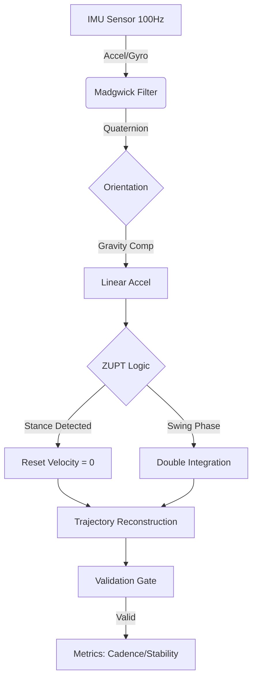

# GaitOS V13: Advanced Clinical Gait Analysis System

*Figure 1: Real-time V13 Dashboard showing Cadence, Stability, and Trajectory metrics.*

## 🩺 System Overview

**GaitOS** is a high-precision, open-source firmware designed for the **M5StickC Plus 2** platform. It transforms consumer-grade hardware into a professional **Inertial Navigation System (INS)** capable of reconstructing the 3D trajectory of the human foot in real-time.

By fusing **Physics-Based Kinetics** (ZUPT-INS) with **Empirical Validation Algorithms**, GaitOS eliminates the sensor drift common in traditional accelerometer-based pedometers, delivering research-grade metrics for clinical assessment and rehabilitation monitoring.

### 🔄 Data Flow Architecture

### 🔬 Core Capabilities

* **3D Trajectory Reconstruction**: Visualizes the swing path (Clearance vs. Stride Length) in real-time.
* **Temporal-Spatial Metrics**:
  * **Cadence (SPM)**: Real-time steps per minute tracking.
  * **Stability Index**: Variance-based gait rhythm analysis (0-100%).
  * **Clearance**: Maximum foot height measurement (cm).
* **Hybrid Engine (V13)**: Combines Zero Velocity Updates (ZUPT) with time-gated amplitude validation to reject noise and ensure robust data in real-world environments.
* **Drift Cancellation**: "Double-Tap" Zeroing Protocol for calibration.

---

## 🏗️ System Architecture

The GaitOS engine operates on a 100Hz sensor fusion loop, processing data through three distinct stages:

1. **Sensor Fusion (Madgwick Filter)**:
    * Integrates Accelerometer ($a_{xyz}$) and Gyroscope ($g_{xyz}$) data.
    * Estimates Orientation (Quaternion $q_{0-3}$) and Euler Angles (Pitch, Roll, Yaw).
2. **Trajectory Integration (ZUPT)**:
    * Detects **Stance Phase** using a Gyroscopic Threshold ($<40^\circ/s$).
    * Resets velocity to zero during stance to eliminate integration error.
    * Integrates acceleration to Velocity ($v$) and Position ($p$) during **Swing Phase**.
3. **Hybrid Validation (The "Gate")**:
    * **Time Gate**: Rejects steps $<300ms$ (prevents vibration artifacts).
    * **Amplitude Gate**: Requires $>1.2G$ acceleration (validates physical swing).
    * **Drift Clamp**: Limits unrealistic stride lengths ($>1.5m$).

---

## 📊 Technical Specifications

| Feature | Specification |
| :--- | :--- |
| **Platform** | M5StickC Plus 2 (ESP32-PICO-V3-02) |
| **Sensor** | MPU6886 / SH200Q (6-Axis IMU) |
| **Sampling Rate** | 100 Hz (10ms Loop) |
| **Output Data** | CSV (Raw + Kinematics), JSON (Real-time) |
| **Connectivity** | Wi-Fi SoftAP (`192.168.4.1`) |
| **Latency** | <15ms (Device), <100ms (Web Dashboard) |

---

## 🚀 Installation & Usage

### 1. Firmware Flashing

1. Clone this repository.
2. Open in **VS Code** with **PlatformIO**.
3. Connect M5StickC Plus 2 via USB.
4. Run **PlatformIO: Upload**.

### 2. Device Attachment

**CRITICAL**: The device must be firmly attached to the **foot/shoe** to function.

* **Orientation**: Screen facing **OUT** (Lateral) or **UP** (Instep).
* Ensure the device is tight. Any wobble will introduce noise.

### 3. Calibration (Zeroing)

To ensure trajectory accuracy:

1. Place the foot/device **FLAT** on the ground.
2. Select **System > Zero Sensors** (or use the Web UI).
3. **Remain motionless** for 2 seconds while the system samples gyroscope bias.

### 4. Data Acquisition

* **Device UI**: View live Step Count, Cadence, and Trajectory Scope.
* **Web Dashboard**: Connect to WiFi `GAIT-LOGGER` (Pass: `circumduct123`).
  * Navigate to `http://192.168.4.1`.
  * View Full-Screen Trajectory, Stability Metrics, and Download Logs.

---

## 📁 Data Format

Log files are saved as `.csv` in the internal specific storage.

| Column | Unit | Description |
| :--- | :--- | :--- |
| `t` | ms | Timestamp |
| `ax, ay, az` | g | Raw Acceleration |
| `gx, gy, gz` | dps | Raw Gyroscope |
| `px, py, pz` | m | Calculated Position (X, Y, Z) |
| `phase` | 0/1 | 0=Stance, 1=Swing |
| `roll, pitch, yaw` | deg | Foot Orientation |
| `cadence` | spm | Steps Per Minute |

---

**GaitOS Research Project**
*Developed for advanced biomechanical analysis.*
