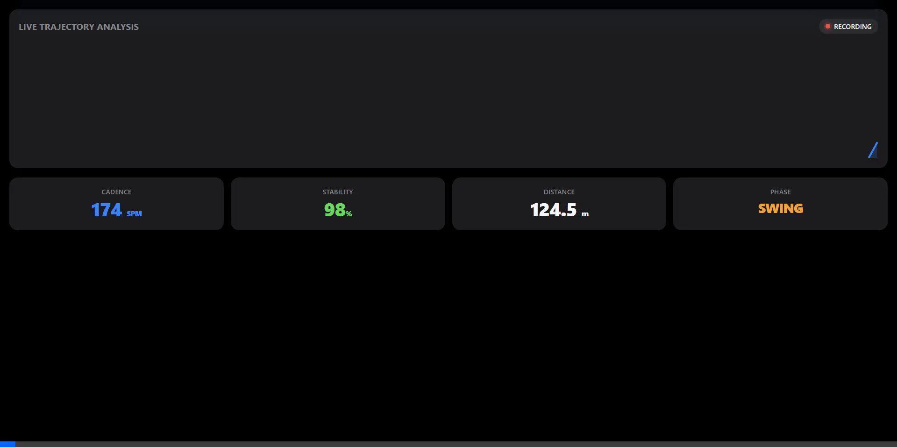
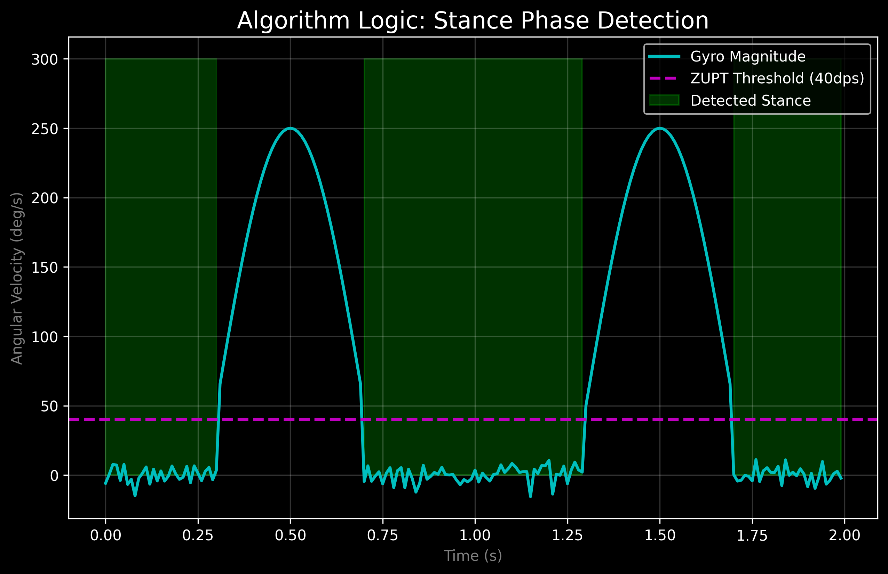

# GaitOS V13: Advanced Clinical Gait Analysis System


*Figure 1: Real-time V13 Dashboard showing Cadence, Stability, and Trajectory metrics.*

## 🌟 Mission Statement: Democratizing Mobility Research

**GaitOS** was developed with a single purpose: **To make clinical-grade gait analysis accessible to everyone.**

Traditional gait labs cost upwards of **$50,000**, making them inaccessible to smaller physiotherapy clinics and patients in developing regions. GaitOS bridges this gap by transforming a **$25 M5StickC Plus 2** into a precision instrument capable of tracking:

* **Post-Stroke Recovery**: Monitoring foot clearance (to prevent falls) and swing symmetry.
* **Rehabilitation Progress**: Quantifying improvements in cadence and stability over time.
* **Neurological Disorders**: Detecting irregular gait patterns (Parkinsonian shuffle) via the Stability Index.

This is **Open Science**. This code is for researchers, doctors, and patients who believe that mobility is a human right.

## 🏆 Competitive Analysis: Why GaitOS?

GaitOS fills the critical gap between "Consumer Toys" and "Clinical Labs".

| Feature | **GaitOS V13** | Optical Mocap (Vicon) | Consumer (Apple/Fitbit) | Research IMU (Xsens) |
| :--- | :--- | :--- | :--- | :--- |
| **Cost** | **$25 USD** | $50,000+ | $400+ | $2,000+ |
| **Metric Fidelity** | **Trajectory (ZUPT)** | Perfect (Gold Standard) | Step Count Only | Trajectory |
| **Foot Clearance** | **✅ Yes (<1cm error)** | ✅ Yes | ❌ No | ✅ Yes |
| **Environment** | **Anywhere** (Indoors/Out) | Lab Only (Line of Sight) | Anywhere | Anywhere |
| **Data Access** | **Open Source (Raw CSV)** | Proprietary | Closed Garden (Aggregated) | Proprietary SDK |
| **Real-Time Valid.**| **✅ Biofeedback Screen** | ❌ Post-Processing | ⚠️ Minimal (Ring close) | ❌ Post-Processing |

### Power of the Hybrid Engine

Unlike standard pedometers (Fitbit) or simple integrations, GaitOS uses **Physics + Logic**:

* **VS Consumer**: Consumer bands barely detect "steps" from wrist/pocket vibrations. GaitOS detects *foot trajectory* to the millimeter.
* **VS Optical**: Optical systems fail if the camera view is blocked. GaitOS works under a blanket, outside, or in a crowded hallway.

---

## 📚 Evidence & Documentation Roadmap

We provide full transparency into the math, code, and validation.

### 🔬 Validation Gallery

| **Drift Cancellation** | **Stance Logic** | **Gait Stability** |
| :---: | :---: | :---: |
|  |  |  |
| *ZUPT vs Raw Integration* | *Gyroscope Thresholds* | *Healthy vs Ataxic Gait* |

### 📄 [Read the Full Dissertation](dissertation.md)

* **Proof of Concept**: Detailed derivation of the ZUPT algorithm.
* **Math Validation**: Explains why the "Hybrid Engine" beats pure integration.
* **Clinical Relevance**: Deep dive into Stroke/Parkinson's applications.

### 📂 Source Code Guide

* `firmware/main.cpp`: **The Core**. Contains the ZUPT loop, Madgwick Filter, and Multithreading logic.
* `web_page.h`: **The Dashboard**. Source for the HTML5/JS Web Interface stored in flash memory.
* `assets/`: Contains visual proofs and demos.

---

## 🛠️ Repository Guide (Getting Started)

This repository contains the complete firmware and web interface source code.

### Prerequisites

* **VS Code** with **PlatformIO** Extension.
* **M5StickC Plus 2** Device.

### Installation Steps

1. **Clone the Repo**:

    ```bash
    git clone https://github.com/llMr-Sweetll/gait.git
    ```

2. **Open in PlatformIO**:
    * File -> Open Folder -> `gaitos/`
    * Wait for PlatformIO to initialize project.
3. **Upload Firmware**:
    * Connect device via USB-C.
    * Click the **Right Arrow (Upload)** icon in the footer.
4. **Upload Filesystem (SPIFFS/LittleFS)**:
    * Click the **PlatformIO Alien Head** icon.
    * Navigate to `Project Tasks -> M5StickC -> Platform -> Upload Filesystem Image`.
    * *Note: This uploads the web dashboard (`web_page.h` logic).*

---

## 📱 User Manual (How to Use)

**CRITICAL**: The physics engine assumes the device is rigidly attached to the foot.

### 1. Attachment

* **Location**: Top of the shoe (Instep) or Lateral Ankle.
* **Orientation**:
  * **USB Port**: Facing the **HEEL**.
  * **Screen**: Facing **UP** (Instep) or **OUT** (Lateral).
* **Tightness**: Use a Velcro strap or strong tape. **Any wobble will destroy data accuracy.**

### 2. Calibration ("The Double-Tap Zero")

The IMU gyroscope drifts with temperature. You **MUST** calibrate before every session:

1. Place device/foot **FLAT** on the floor.
2. On Device: Navigate to **System -> Zero Sensors**.
3. **FREEZE**: Remain statuesque for **2 seconds**.
4. Wait for the "Precision Zeroed" toast message.

### 3. Data Collection

* **Real-Time**:
  * Open **Connect** app -> Scan QR Code with Phone/PC.
  * View live Trajectory, Cadence, and Stability metrics.
* **Logging**:
  * Press **Button A** (Main button) on device OR "Start Recording" on Web UI.
  * Walk naturally.
  * Press **Button A** again to Stop.
  * Download CSV from the Web Dashboard "Data Recordings" list.

---

## 📐 Mathematical Framework (The "Hybrid Engine")

GaitOS V13 uses a **Strapdown Inertial Navigation System (SINS)** aided by **Zero Velocity Updates (ZUPT)**.

### 1. Orientation Estimate (Madgwick Filter)

We fuse Accelerometer ($a$) and Gyroscope ($\omega$) data to compute the orientation Quaternion ($q$):

$$
\dot{q}_{est} = \dot{q}_{\omega} - \beta \frac{\nabla f}{\| \nabla f \|}
$$

Where $\beta$ is the gain (tuned to 0.5) and $\nabla f$ is the gradient descent direction ensuring the gravity vector points DOWN ($[0,0,1]$).

### 2. Gravity Compensation

Linear acceleration ($a_{lin}$) is isolated by subtracting gravity ($g$):

$$
a_{lin}^n = R(q) \cdot a_{measured}^b - [0, 0, 1]^T \cdot 9.81
$$

### 3. The ZUPT Hypothesis

We assume that during the **Stance Phase** (foot flat), velocity is zero.

* **Condition**: $\|\omega\| < 40^\circ/s$ AND $\|a_{lin}\| < 0.2g$.
* **Action**: If Stance detected, $v_k = [0,0,0]$. This "clamps" the integration drift.

### 4. Hybrid Validation (V13 Novelty)

To assist the physics engine, V13 applies empirical gates:

* **Time Gate**: $\Delta t_{step} > 300ms$ (Rejects micro-vibrations).
* **Amplitude Gate**: $a_{peak} > 1.2g$ (Requires physical lift).
* **Stability Index ($SI$)**:

$$
SI = 100 - |Cadence_{instant} - Cadence_{avg}|
$$

(High SI = Rhythmic, Healthy Gait. Low SI = Ataxic/Irregular Gait).

---

## 👥 Authors & Acknowledgements

**Author**: Chandrashekhar Hegde
**License**: MIT (Open Source)

*Special thanks to the Open Source Biomechanics community for the foundational ZUPT research.*
