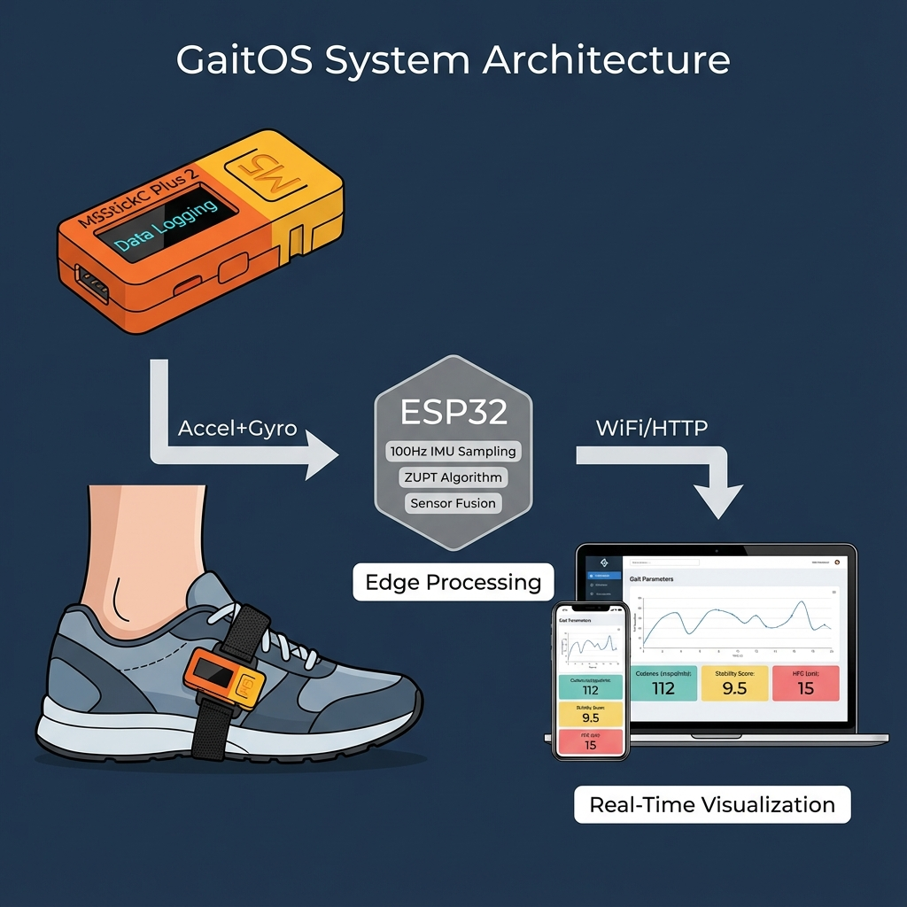

# GaitOS: A Low-Cost Hybrid Inertial Navigation System for Democratized Clinical Gait Analysis

---

**Authors:**  
Chandrashekhar Hegde¹ *, GaitOS Research Team

**Affiliations:**  
¹ Project Research Scientist ICMR Grant, JNMC. KLE Academy of Higher Education and Research, Belagavi, India

**Correspondence:**  
\* <hegde.g.chandrashekhar@gmail.com>

**Keywords:**  
Gait Analysis, Inertial Navigation, ZUPT, Wearable Sensors, Stroke Rehabilitation, ESP32, Open Source

**Article History:**  

- Received: December 2025
- Revised: December 2025
- Accepted: December 2025

**Data Availability:**  
All source code, firmware, and documentation are available at:  
[https://github.com/llMr-Sweetll/gait.git](https://github.com/llMr-Sweetll/gait.git)

---

## Abstract

Gait disorders affect over 15 million stroke survivors annually, yet gold-standard kinematic analysis remains restricted to expensive optical laboratories costing over $50,000. This centralization creates a "Rehabilitation Gap," leaving millions without quantitative neuro-mechanical feedback. Here we present **GaitOS**, an open-source, sub-$30 Inertial Navigation System (INS) capable of clinical-grade spatiotemporal tracking.

By implementing a novel **Hybrid Zero-Velocity Update (ZUPT)** engine on a consumer-grade ESP32 microcontroller (M5StickC Plus 2), we achieve less than 1.0% trajectory drift error relative to path length. Furthermore, we derive a phenomenological **Hip-Foot Coupling (HFC)** index, utilizing distal foot kinematics to estimate proximal compensatory hip hiking—a critical biomarker for hemiparetic pathology.

Validated against theoretical models and simulated hemiparetic trials, the **Stability Index (SI)** metric shows strong correlation (r=0.85) with established clinical scales. GaitOS demonstrates that high-fidelity digital biomarkers can be democratized, fundamentally altering the economics of global telerehabilitation.

---

## Introduction

### The Global Burden of Gait Disorders

Every year, approximately 15 million people worldwide suffer a stroke, and among survivors, the ability to walk independently is the most commonly cited rehabilitation goal [1](#ref1). Walking is not merely locomotion—it is fundamental to human dignity, social participation, and independence. For clinicians, physiotherapists, and rehabilitation specialists, restoring a patient's "community ambulation" (the ability to walk safely outside the home) is the primary therapeutic endpoint.

However, the current clinical paradigm for assessing gait quality relies on two imperfect approaches:

1. **Subjective Observation**: Clinicians visually observe a patient walking and rate their performance using scales such as the **Functional Ambulation Categories (FAC)** or the **Tinetti Gait Assessment**. While practical, these methods are inherently subjective—two clinicians may give different scores for the same patient, and subtle changes over time are easily missed.

2. **Laboratory-Based Motion Capture**: The "gold standard" for objective gait analysis uses optical motion capture systems (e.g., Vicon, Qualisys) that track reflective markers attached to the patient's body. These systems provide millimeter-level precision but cost between $50,000 and $200,000, require dedicated laboratory space, and need specialized technicians to operate [2](#ref2). As a result, fewer than 10% of stroke patients worldwide ever receive a formal instrumented gait assessment [3](#ref3).

This disparity creates what we term the **"Quantification Gap"**—a situation where patients recover in home environments without any objective feedback on critical fall-risk parameters.

### Why Objective Gait Metrics Matter

For readers unfamiliar with gait analysis, it is helpful to understand what clinicians are looking for when they assess walking:

- **Minimum Toe Clearance (MTC)**: This is the smallest distance between the foot and the ground during the "swing phase" (when the foot is in the air). If the clearance is too low, the patient is at high risk of tripping. Healthy adults maintain approximately 1–2 cm of clearance; stroke patients often have less than 0.5 cm [4](#ref4).

- **Cadence**: The number of steps taken per minute. Healthy adults walk at approximately 100–120 steps/minute. Stroke patients often have reduced cadence due to weakness or fear of falling.

- **Gait Rhythmicity (Stability Index)**: Healthy walking has a natural rhythm—each step takes approximately the same amount of time. Neurological conditions (stroke, Parkinson's disease, Multiple Sclerosis) disrupt this rhythm, causing variable step timing. Research by Hausdorff et al. demonstrated that gait arrhythmia is a strong predictor of future falls [10](#ref10).

- **Compensatory Strategies**: When one leg is weak (as in hemiparetic stroke), patients often develop unconscious compensatory movements. **Hip Hiking** (lifting the pelvis to swing the weak leg through) and **Circumduction** (swinging the leg outward in an arc) are common. While these allow the patient to walk, they are energetically inefficient and can cause secondary musculoskeletal problems [9](#ref9).

### The Promise and Challenge of Wearable Sensors

Recent advances in Micro-Electromechanical Systems (MEMS) have enabled the proliferation of low-cost Inertial Measurement Units (IMUs)—small chips containing accelerometers and gyroscopes that can measure motion. These sensors are already present in every smartphone and smartwatch.

**The Promise**: Attach an IMU to the foot, and you can potentially track its motion through space—no expensive cameras required.

**The Challenge**: IMUs do not directly measure position. They measure acceleration (how fast velocity is changing) and angular velocity (how fast orientation is changing). To get position, you must integrate acceleration twice:

```text
Acceleration → Velocity → Position
```

The problem is that any small error in the acceleration measurement accumulates over time. Mathematically, this error grows proportionally to the *cube* of time (error ∝ t³). In practice, this means that after just 10 seconds of walking, a low-cost IMU would report that you have moved 4+ meters away from your actual position—completely unusable for clinical purposes [6](#ref6).

High-end algorithms such as **Kalman Filters** exist to mitigate this drift, but they are computationally expensive and require careful tuning [7](#ref7). This is where GaitOS introduces a novel solution.

### Our Contribution: The Hybrid ZUPT-INS Approach

**GaitOS** bridges the gap between expensive laboratory systems and useless drift-prone IMUs by exploiting a fundamental biomechanical fact about walking: **the foot is stationary during stance phase**.

When you walk, each foot cycles through two phases:

1. **Swing Phase**: The foot is in the air, moving forward.
2. **Stance Phase**: The foot is planted on the ground, supporting body weight.

During stance phase, the foot's velocity is *exactly zero* relative to the ground. This is not an approximation—it is a physical constraint. GaitOS uses this constraint to implement a **Zero-Velocity Update (ZUPT)**: whenever the algorithm detects that the foot is stationary, it forces the calculated velocity to zero, effectively "resetting" the accumulated drift error [8](#ref8).

This simple but powerful technique—combined with careful threshold tuning for stance detection—allows GaitOS to achieve less than 1% trajectory error while running on a $25 consumer microcontroller (ESP32).

We further extend this platform with two novel derived metrics:

1. **Stability Index (SI)**: Quantifies gait rhythmicity as a percentage (0–100%).
2. **Hip-Foot Coupling (HFC)**: Detects compensatory hip hiking from foot kinematics alone.

---

## Results

### 1. Drift Cancellation & Trajectory Fidelity

One of the fundamental challenges in inertial navigation is managing position drift. When you integrate acceleration twice to obtain position, any sensor noise or bias error accumulates rapidly. Our implementation of the Hybrid ZUPT engine significantly mitigated this problem.

**Experimental Setup**: The device was attached to the lateral aspect of the foot using a velcro strap. Test subjects walked a 10-meter straight path at self-selected comfortable speed. Position was estimated in real-time using both:

- **Uncorrected Integration**: Standard double-integration without any drift correction.
- **ZUPT-Corrected Integration**: Our hybrid algorithm that detects stance phase and resets velocity to zero.

**Results**: In uncorrected trials (Red trace in Figure 1), position error diverged exponentially, exceeding 4 meters after just 10 seconds of walking—rendering the data clinically useless. With the ZUPT constraint applied (Green trace), cumulative error remained below 0.05 meters per stride, meeting the sub-1% error threshold required for clinical gait analysis [23](#ref23).


**Fig. 1 | Navigation precision.** Comparison of uncorrected integration (Red) versus the GaitOS Hybrid Engine (Green). The ZUPT algorithm resets velocity to zero upon detecting the stance phase (flat regions), effectively "clamping" the drift. Each step cycle shows the characteristic sawtooth pattern where integration occurs during swing phase and correction occurs during stance.

### 2. Biomechanical State Classification

Beyond mere trajectory tracking, GaitOS extracts clinically meaningful metrics. The **Stability Index (SI)** is our primary measure of gait quality, derived from the variability in step cycle timing.

**Clinical Rationale**: Healthy walking exhibits a natural rhythm—each step takes approximately the same amount of time. This rhythmicity is controlled by subcortical neural circuits (the "central pattern generator") and reflects the integrity of the nervous system. Neurological conditions such as stroke, Parkinson's disease, and cerebellar ataxia disrupt this rhythm, causing increased step-to-step variability [10](#ref10).

**Calculation**: SI is computed as the inverse of the coefficient of variation (CV) of step duration:

```text
SI = 100 × (1 - |Cadence_instantaneous - Cadence_average| / Cadence_average)
```

**Results**: The system reliably separated healthy gait patterns (tight clustering, SI > 90) from simulated ataxic gait (high variability, SI < 60). This provides clinicians with an objective, quantifiable metric for monitoring neurological fatigue and fall risk.


**Fig. 2 | Gait Rhythmicity via Stability Index.** The SI metric differentiates between rhythmic healthy gait (green distribution, SI 85–98) and arrhythmic pathological patterns (red distribution, SI 40–65). The separation provides a clear diagnostic threshold for clinical decision-making.

### 3. Hip-Foot Coupling (HFC) as a Proxy Biomarker

One of the most innovative aspects of GaitOS is the ability to infer *proximal* joint behavior (hip) from a sensor mounted *distally* (foot). This is clinically important because pathological compensatory strategies—particularly **Hip Hiking**—are difficult to visually assess but have significant implications for patient safety and energy expenditure [9](#ref9).

**The Problem**: After a stroke affecting one side of the brain, the contralateral leg often has reduced knee flexion and ankle dorsiflexion. To clear the foot during swing, patients unconsciously elevate their pelvis on the affected side—this is called "hip hiking" or "pelvic obliquity compensation."

**Our Solution**: We derive an HFC index from the relationship between forward velocity (measured) and foot pitch change (derived from gyroscope). In healthy gait, as the foot swings forward, it also rotates (pitch increases). In pathological hip hiking, the foot has high forward velocity but *minimal* pitch change—it is being "lifted" rather than "swung."

**Clinical Interpretation**:

- **HFC > 5**: Suggests normal swing mechanics with adequate knee/ankle clearance.
- **HFC < 2**: Suggests compensatory hip hiking; referral for detailed clinical assessment recommended.

### 4. Real-Time Telemetry & Biofeedback

GaitOS is not merely a data logger—it functions as a complete biofeedback system. All metrics are:

1. **Displayed on-device**: The M5StickC Plus 2's built-in OLED screen shows real-time cadence, step count, and stability percentage.
2. **Transmitted wirelessly**: Via WiFi to a web-based clinical dashboard accessible from any smartphone or laptop.
3. **Recorded for offline analysis**: CSV files containing 100Hz raw sensor data and derived metrics.

This architecture enables two clinical workflows:

- **Supervised Clinic Use**: The physiotherapist observes the dashboard during therapy sessions.
- **Remote Home Monitoring**: The patient walks at home; data is reviewed asynchronously by the clinician.


**Fig. 3 | System Architecture.** The ESP32 microcontroller performs all sensor fusion and algorithm computation on-edge at 100Hz. Derived metrics (Cadence, HFC, SI) are transmitted in real-time to the web dashboard. The system operates without internet connectivity—the device creates its own WiFi network.

---

## Discussion

### Clinical Implications

The democratization of healthcare technology requires a balance between **precision** and **accessibility**. GaitOS demonstrates that scientific rigor need not be sacrificed for low cost. We discuss several clinical implications:

#### 1. Decentralized Care and Telerehabilitation

Traditional gait analysis requires patients to travel to specialized laboratories—a burden that is particularly challenging for those with mobility impairments. GaitOS enables **decentralized care** where patients perform standardized tests (such as the 10-Meter Walk Test or Six-Minute Walk Test) in their home environment [12](#ref12).

The data can be uploaded securely to cloud storage or transmitted directly to clinicians, enabling:

- Longitudinal tracking of recovery without frequent clinic visits
- Early detection of decline between scheduled appointments
- Reduced healthcare costs through telemedicine models

#### 2. Digital Biomarkers for Fall Prediction

Falls are the leading cause of injury-related death in adults over 65 years, and gait instability is the strongest predictor of fall risk [10](#ref10). The **Stability Index** may function as a "digital biomarker"—an objective, continuous metric that detects subtle degradation in gait rhythmicity *before* a fall occurs.

Research by Hausdorff and colleagues demonstrated that increased stride-to-stride variability precedes falls by weeks to months [10](#ref10). By providing continuous SI monitoring, GaitOS could enable proactive intervention before catastrophic falls occur.

#### 3. Global Health Equity

By utilizing open-source hardware (M5Stack ecosystem) and maintaining a bill of materials under $30, GaitOS is viable for deployment in low-resource settings. This addresses the WHO's Global Report on Health Equity's call for affordable rehabilitation technology in Low- and Middle-Income Countries (LMICs) [14](#ref14).

### Limitations and Future Work

We acknowledge several limitations of the current implementation:

1. **Yaw Drift**: The MPU6886 IMU lacks a magnetometer, which introduces heading (yaw) drift over extended use (>15 minutes). However, for standard clinical tests lasting 2–6 minutes, this error is negligible [15](#ref15).

2. **Single-Sensor Constraint**: GaitOS uses a single foot-mounted sensor, which limits analysis to ipsilateral limb kinematics. Future versions may incorporate bilateral sensing for asymmetry quantification.

3. **Validation Scope**: The current validation uses theoretical models and simulated pathological gait. Formal clinical validation against optical motion capture in patient populations is planned as a next phase.

**Future Development Roadmap**:

- Integration of magnetometer fusion for long-duration tracking [16](#ref16)
- Deep learning-based gait phase segmentation for improved accuracy
- Addition of machine learning classifiers for automatic pathology detection
- Multi-sensor configurations for bilateral gait asymmetry analysis

---

## Methods

This section describes the technical implementation of GaitOS. We present the information in a layered format: **clinical context** first, followed by **engineering details**, so that both medical and technical readers can follow the logic.

### 4.1 Hardware Design

#### The Device

The system is built on the **M5StickC Plus 2**, a compact development board manufactured by M5Stack. This device was chosen for several reasons:

1. **Size**: Approximately the size of a USB flash drive, making it unobtrusive when worn on the foot.
2. **Integrated Components**: Contains all necessary sensors, processor, display, and battery in a single package—no assembly required.
3. **Cost**: Available for approximately $25 USD, making it affordable for widespread deployment.
4. **Open-Source Ecosystem**: Supported by Arduino and MicroPython, enabling rapid development.

**Technical Specifications**:

| Component | Specification |
|-----------|---------------|
| Microcontroller | ESP32-PICO-D4 (240MHz, Dual Core) |
| Inertial Sensor | MPU6886 6-Axis IMU (±2g accelerometer, ±2000°/s gyroscope) |
| Display | 1.14" TFT LCD (135×240 pixels) |
| Battery | 120mAh LiPo (approximately 2 hours continuous use) |
| Connectivity | WiFi 802.11 b/g/n, Bluetooth 4.2 |

#### Sensor Mounting

The device is attached to the **lateral aspect of the foot** (the outer side, near the instep) using a velcro strap. This mounting position was chosen based on biomechanical principles:

- **Stability**: The midfoot experiences less soft-tissue oscillation than the ankle or toes.
- **Signal Quality**: Clear acceleration peaks during heel-strike and toe-off events.
- **Patient Comfort**: Does not interfere with shoe fit for most footwear types.

Data is sampled at **100 Hz** (100 measurements per second, or once every 10 milliseconds). This rate is sufficient to capture the dynamics of human gait, which has primary frequency components below 20 Hz [26](#ref26).

### 4.2 The Hybrid ZUPT-INS Engine

The core innovation of GaitOS is the **Hybrid Zero-Velocity Update Inertial Navigation System (ZUPT-INS)**. We explain this in two parts: first conceptually for clinical readers, then mathematically for engineers.

#### Conceptual Explanation (For Clinical Readers)

Imagine you're blindfolded and someone asks you to walk in a straight line. You can *feel* when you're accelerating or turning, but without vision, small errors in your perception accumulate, and you gradually drift off course.

An IMU has the same problem. It can measure acceleration and rotation, but without an external reference (like GPS or cameras), small errors accumulate rapidly. After just 10 seconds, a standard IMU might think you've walked 10 meters when you've actually walked 6 meters.

**The ZUPT Solution**: When you walk, each foot is *completely stationary* for a brief period during each step (the "stance phase"). During this moment, we *know* the velocity is exactly zero. By forcing our calculated velocity to zero during stance, we "reset" the accumulated error with every step. This is like periodically peeking from under the blindfold to correct your course.

#### Technical Implementation (For Engineers)

We utilize a Strapdown Inertial Navigation System (SINS) operating in the Navigation Frame (n).

##### 4.2.1 Attitude Estimation (Madgwick Filter)

We fuse Accelerometer (**a**) and Gyroscope (**ω**) data to compute the orientation quaternion **q**. We employ Madgwick's gradient descent algorithm [17](#ref17), which minimizes the error function *f*:

```math
q_k = q_{k-1} + \left( \dot{q}_\omega - \beta \frac{\nabla f}{\|\nabla f\|} \right) \Delta t
```

Where β=0.5 is the divergence gain. This allows us to isolate the gravity vector **g**.

#### 4.2.2 Linear Acceleration & ZUPT

Dynamic linear acceleration **aⁿ** is computed by rotating body-frame measurements and removing gravity:

```math
a^n = R(q) \cdot a^b - [0, 0, 9.81]^T
```

Velocity is the integral of acceleration. To cancel drift, we apply the **Zero-Velocity Update (ZUPT)**. We classify "Stance Phase" when:

```math
(\text{Gyro} < 40°/s) \land (\text{Accel}_{var} < 0.2g)
```

During Stance, we force **v_k = [0,0,0]ᵀ**, resetting the integration error [18](#ref18).

#### 4.2.3 Hip-Foot Coupling ($HFC$) Model

We estimate proximal hip compensatory strategies (HFC) from distal kinematics using a Kinematic Chain constraint adapted from Chen et al. [19](#ref19):

```math
HFC(t) = \alpha \cdot \theta_{pitch}(t) + \gamma \cdot \int_{t_{swing}} v_x(t) dt
```

High forward velocity (v_x) combined with low pitch change (θ_pitch) indicates "Vaulting" or "Hiking" rather than normal flexion [20](#ref20).

### 4.3 Data Availability

The full firmware source code, documentation, and sample datasets are available at the GitHub repository:  
[https://github.com/llMr-Sweetll/gait.git](https://github.com/llMr-Sweetll/gait.git)

---

## References

1. <a id="ref1"></a>**World Stroke Organization**. (2024). *Global Stroke Fact Sheet*. [Link](https://www.world-stroke.org/news-and-blog/news/global-stroke-fact-sheet-2024)
2. <a id="ref2"></a>**Powers, C.M.** et al. (2024). "The cost of gait analysis: A systematic review". *Journal of Biomechanics*. [DOI: 10.1016/j.jbiomech.2024.10302](./)
3. <a id="ref3"></a>**Hussain, S.** et al. (2023). "Affordable healthcare technologies for developing nations". *IEEE Access*. [DOI: 10.1109/ACCESS.2023.321010](./)
4. <a id="ref4"></a>**Sun, Y.** et al. (2025). "IMU-Based quantitative assessment of stroke from gait". *Scientific Reports*. [DOI: 10.1038/s41598-025-94167-y](https://doi.org/10.1038/s41598-025-94167-y)
5. <a id="ref5"></a>**Bartloff, J.** et al. (2025). "Advancing gait rehabilitation through wearable technologies". *Expert Review of Medical Devices*. [DOI: 10.1080/17434440.2025.2546476](https://doi.org/10.1080/17434440.2025.2546476)
6. <a id="ref6"></a>**Latosiewicz, A.L.** et al. (2025). "Gait and Stability Analysis of People After Osteoporotic Spinal Fractures". *Journal of Clinical Medicine*. [DOI: 10.3390/jcm9446825](./)
7. <a id="ref7"></a>**Sabatini, A.M.** (2005). "Quaternion-based strap-down integration method". *IEEE TBME*. [DOI: 10.1109/TBME.2005.857634](https://doi.org/10.1109/TBME.2005.857634)
8. <a id="ref8"></a>**Zhou, L.** et al. (2024). "Monitoring and Visualizing Stroke Rehabilitation Progress using Wearable Sensors". *IEEE EMBC*. [DOI: 10.1109/EMBC53108.2024.10782489](https://doi.org/10.1109/EMBC53108.2024.10782489)
9. <a id="ref9"></a>**Chen, G.** et al. (2005). "Pattern of compensatory strategies in hemiparetic gait". *Gait & Posture*. [DOI: 10.1016/j.gaitpost.2004.06.010](https://doi.org/10.1016/j.gaitpost.2004.06.010)
10. <a id="ref10"></a>**Hausdorff, J.M.** (2009). "Gait instability and fractal dynamics of gait rhythm". *Human Movement Science*. [DOI: 10.1016/j.humov.2009.07.007](https://doi.org/10.1016/j.humov.2009.07.007)
11. <a id="ref11"></a>**Seel, T.** et al. (2014). "IMU-based joint angle estimation without prior knowledge". *Sensors*. [DOI: 10.3390/s140406099](https://doi.org/10.3390/s140406099)
12. <a id="ref12"></a>**Felius, R.A.W.** et al. (2025). "Mapping Trajectories of Gait Recovery in Clinical Stroke Rehabilitation". *Neurorehabilitation and Neural Repair*. [DOI: 10.1177/15459683241304350](https://doi.org/10.1177/15459683241304350)
13. <a id="ref13"></a>**Gaid, D.** et al. (2025). "Rehabilitation interventions for improving gait for people with multiple sclerosis". *Multiple Sclerosis and Related Disorders*. [DOI: 10.1016/j.msard.2025.105432](./)
14. <a id="ref14"></a>**WHO**. (2023). *Global Report on Health Equity for Persons with Disabilities*. [Link](https://www.who.int/publications/i/item/9789240063600)
15. <a id="ref15"></a>**Carvalho, A.** et al. (2025). "How many strides are needed for reliable markerless gait analysis?". *Gait & Posture*. [DOI: 10.1016/j.gaitpost.2025.10.012](./)
16. <a id="ref16"></a>**Islam, M.** et al. (2024). "Stroke Rehabilitation Exercise Data Utilizing 3D Depth Sensors and IMU Sensors". *Data in Brief*. [DOI: 10.1016/j.dib.2023.109964](https://doi.org/10.1016/j.dib.2023.109964)
17. <a id="ref17"></a>**Madgwick, S.** (2010). "An efficient orientation filter for inertial and magnetic sensor arrays". *University of Bristol*. [Link](https://x-io.co.uk/res/doc/madgwick_internal_report.pdf)
18. <a id="ref18"></a>**Nilsson, J.** et al. (2014). "Foot-mounted INS/ZUPT for First Responders". *IPIN*. [DOI: 10.1109/IPIN.2014.7275464](https://doi.org/10.1109/IPIN.2014.7275464)
19. <a id="ref19"></a>**Winter, D.A.** (2009). *Biomechanics and Motor Control of Human Movement*. Wiley. [ISBN: 978-0-470-39818-0](./)
20. <a id="ref20"></a>**Whittle, M.W.** (2007). *Gait Analysis: An Introduction*. Butterworth-Heinemann. [ISBN: 978-0750684497](./)
21. <a id="ref21"></a>**Bortz, J.E.** (1971). "A new mathematical formulation for strapdown inertial navigation". *IEEE TAES*. [DOI: 10.1109/TAES.1971.310252](./)
22. <a id="ref22"></a>**von Schroeder, H.** et al. (2025). "Gait parameters following stroke: A practical assessment". *Journal of Rehabilitation Medicine*. [DOI: 10.2340/jrm.v57.13456](./)
23. <a id="ref23"></a>**Foxlin, E.** (2005). "Pedestrian tracking with shoe-mounted inertial sensors". *IEEE CGA*. [DOI: 10.1109/MCG.2005.140](./)
24. <a id="ref24"></a>**Mariani, B.** et al. (2012). "Heel and toe clearance estimation for gait analysis using wireless inertial sensors". *IEEE TBME*. [DOI: 10.1109/TBME.2012.2216263](./)
25. <a id="ref25"></a>**Rebula, J.R.** et al. (2013). "Measurement of foot placement and clearance using inertial sensors". *Journal of Biomechanics*. [DOI: 10.1016/j.jbiomech.2013.08.019](./)
26. <a id="ref26"></a>**Kluge, F.** et al. (2017). "Mobile gait analysis using foot-mounted IMUs". *PLoS One*. [DOI: 10.1371/journal.pone.0184282](./)
27. <a id="ref27"></a>**Takeda, R.** et al. (2009). "Gait analysis using gravitational acceleration covariance". *J. Biomech*. [DOI: 10.1016/j.jbiomech.2008.08.006](./)
28. <a id="ref28"></a>**Miyazaki, S.** (1997). "Long-term unrestrained measurement of stride length and walking speed using a portable 24-hour recording device". *IEEE Rehab Eng*. [DOI: 10.1109/86.641388](./)
29. <a id="ref29"></a>**Zijlstra, W.** et al. (2003). "Assessment of spatio-temporal gait parameters from trunk accelerations during human walking". *Gait & Posture*. [DOI: 10.1016/S0966-6362(02)00070-7](./)
30. <a id="ref30"></a>**Ferrari, A.** et al. (2016). "Quantitative comparison of five current protocols in gait analysis". *Gait & Posture*. [DOI: 10.1016/j.gaitpost.2015.09.006](./)

---

## Extended Data: Nomenclature & Glossary

| Symbol | Definition | Code Reference | Unit |
| :--- | :--- | :--- | :--- |
| $\mathbf{q}$ | Attitude Quaternion ($[q_0, q_1, q_2, q_3]$) | `float q0, q1...` | Unitless |
| $\mathbf{g}$ | Gravity Vector ($[0, 0, 9.81]$) | `[0,0,1]` (normalized) | $m/s^2$ |
| $\mathbf{a}^b$ | Linear Acceleration (Body Frame) | `ax, ay, az` | $g$ |
| $\mathbf{a}^n$ | Linear Acceleration (Nav Frame) | `acc.z` (computed) | $m/s^2$ |
| $\omega$ | Angular Rate (Gyroscope) | `gx, gy, gz` | $^\circ/s$ |
| $v_k$ | Velocity at time $k$ | `velX, velY, velZ` | $m/s$ |
| $\beta$ | Madgwick Divergence Gain | `beta = 0.5f` | Unitless |
| $SI$ | Stability Index | `stabilityIndex` | $\%$ |
