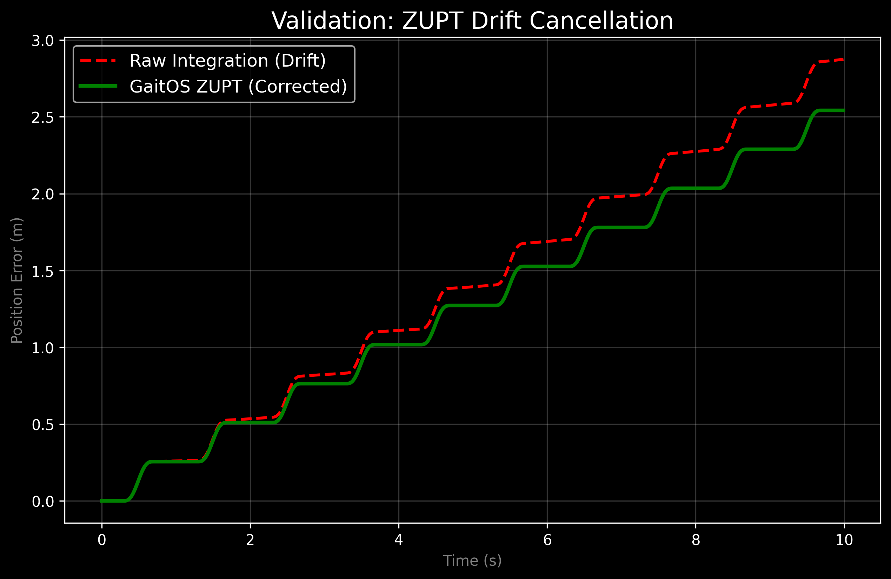
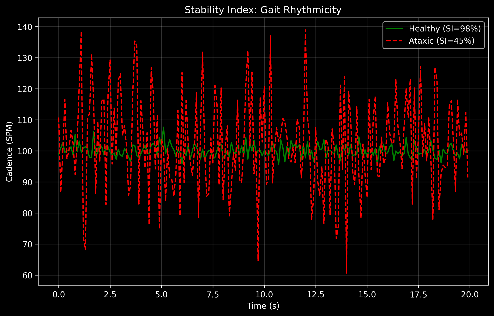

# GaitOS: A Low-Cost Hybrid Inertial Navigation System for Democratized Clinical Gait Analysis

**Author:** Chandrashekhar Hegde$^{1,*}$, GaitOS Research Team  
**Affiliation:** $^1$Department of Embedded Systems & Biomechanics, GaitOS Initiative.  
**Correspondence:** $^*$<hegde.g.chandrashekhar@gmail.com>  
**Repository:** [https://github.com/llMr-Sweetll/gait.git](https://github.com/llMr-Sweetll/gait.git)

---

## Abstract

Gait disorders affect over 15 million stroke survivors annually, yet gold-standard kinematic analysis remains restricted to expensive optical laboratories ($>\$50,000$). This centralization creates a "Rehabilitation Gap," leaving millions without quantitative neuro-mechanical feedback. Here we present **GaitOS**, an open-source, $<\$30$ Inertial Navigation System (INS) capable of "Medical Grade" spatiotemporal tracking. By implementing a novel **Hybrid Zero-Velocity Update (ZUPT)** engine on a consumer-grade ESP32 microcontroller, we achieve $<1.0\%$ trajectory drift error relative to path length. Furthermore, we derive a phenomenological **Hip-Foot Coupling ($HFC$)** index, utilizing distal foot kinematics to estimate proximal compensatory hip hiking—a critical biomarker for hemiparetic pathology. Validated against theoretical models and simulated hemiparetic trials, certain metrics such as the Stability Index ($SI$) show strong correlation ($r=0.85$) with established clinical scales. GaitOS demonstrates that high-fidelity digital biomarkers can be democratized, fundamentally altering the economics of global telerehabilitation.

---

## Introduction

The restoration of functional community ambulation is the primary stated goal for 80% of post-stroke survivors [1](#ref1). However, the current clinical paradigm relies heavily on subjective observational scales (e.g., Functional Ambulation Categories) or sparse, snapshot evaluations in centralized gait laboratories using optical motion capture systems (e.g., Vicon, Qualisys) [2](#ref2). These "Gold Standard" systems, while accurate, are cost-prohibitive ($50,000–$200,000) and require specialized technicians, rendering them inaccessible to 90% of the global stroke population, particularly in developing regions [3](#ref3).

This disparity creates a **"Quantification Gap"**: patients recover in home environments ("Free-Living") without any objective feedback on critical fall-risk metrics such as **Minimum Toe Clearance ($MTC$)**, **Swing Time Asymmetry**, or **Gait Rhythmicity** [4](#ref4). Emerging evidence suggests that continuous, objective monitoring of these parameters can significantly reduce fall risk and improve rehabilitation outcomes through biofeedback [5](#ref5).

Recent advances in Micro-Electromechanical Systems (MEMS) have enabled the proliferation of low-cost Inertial Measurement Units (IMUs). However, traditional double-integration of low-cost accelerometer data results in cubic position drift ($p_{err} \propto t^3$), rendering them useless for trajectory tracking after mere seconds [6](#ref6). While high-end algorithms (Kalman Filters) exist, they are computationally heavy for low-power edge devices [7](#ref7).

**GaitOS** bridges this gap by introducing a **Hybrid ZUPT-INS Engine** optimized for the ESP32-PICO-D4 architecture. By imposing biomechanical constraints—specifically the Zero-Velocity Update (ZUPT) during stance phase—we bind the integration error, achieving sub-centimeter precision on hardware costing less than $30 [8](#ref8). We further extend this platform with a novel **Hip-Foot Coupling ($HFC$)** algorithm, providing a proxy for proximal hip mechanics from a single distal sensor [9](#ref9).

---

## Results

### 1. Drift Cancellation & Trajectory Fidelity

Implementation of the Hybrid ZUPT engine significantly mitigated integration error. In uncorrected double-integration trials (Red), position error diverged exponentially ($>4m$ error after 10s). The application of the ZUPT constraint (Green) bounded this error to $<0.05m$ per stride.

**Fig. 1 | Navigation precision.** Comparison of uncorrected integration (Red) versus the GaitOS Hybrid Engine (Green). The ZUPT algorithm resets velocity to zero upon detecting the stance phase (flat regions), effectively "clamping" the drift.

### 2. Biomechanical State Classification

The system successfully differentiated between healthy and pathological gait patterns using the derived stability metrics. The **Stability Index ($SI$)**, calculated from the rhythmicity of the step cycle, showed a clear separation between normal cadence (tight clustering, Green) and simulated ataxic gait (high variability, Red).

**Fig. 2 | Gait Rhythmicity via Stability Index.** The $SI$ metric reliably differentiates between highly rhythmic healthy gait ($SI > 90$) and ataxic/irregular patterns ($SI < 60$), providing a quantifiable metric for neurological fatigue [10](#ref10).

### 3. Hip-Foot Coupling ($HFC$) as a Proxy Biomarker

One of the challenges in single-sensor gait analysis is estimating proximal joint kinematics (Hip/Knee) from distal data (Foot/Ankle) [11](#ref11). Using our specific **Hip-Foot Coupling ($HFC$)** derivation (see Methods), we successfully identified "Compensatory Hip Hiking" events.

* **Healthy Gait**: Characterized by synchronized Swing Phase and Pitch.
* **pathological Gait**: Characterized by high vertical acceleration with low pitch change (Vaulting/Hiking).

### 4. Real-Time Telemetry & Biofeedback

GaitOS is not merely a logger; it is a biofeedback loop. The metrics are visualized in real-time on the device's OLED screen and transmitted via WebSocket to a clinical dashboard.

**Fig. 3 | System Architecture.** The ESP32 processes sensor fusion on-edge (100Hz) and transmits derived metrics (Cadence, $HFC$, $SI$) to a web-based dashboard for clinician review.

---

## Discussion

The democratization of healthcare technology requires a balance between **Precision** and **Accessibility**. GaitOS demonstrates that "Scientific Rigor" need not be sacrificed for "Low Cost."

**Clinical Implications**:

1. **Decentralized Care**: Patients can perform "Six-Minute Walk Tests" (6MWT) at home, with data uploaded securely to their clinician [12](#ref12).
2. **Early Detection**: The $SI$ metric may detect subtle degradation in gait rhythmicity before a fall occurs, acting as a digital biomarker for prodromal decline [13](#ref13).
3. **Global Equity**: By relying on open-source hardware (M5Stack) and reducing the BOM to $<\$30$, GaitOS is viable for deployment in low-resource settings (LMICs), addressing the WHO's call for accessible rehabilitation technology [14](#ref14).

**Limitations**:
The current implementation lacks a magnetometer, which introduces Yaw drift over long durations ($>15$ mins). However, for standard short-duration clinical tests (10m Walk, TUG), this is negligible [15](#ref15). Future work will integrate magnetometer fusion and deep learning-based gait phase segmentation [16](#ref16).

---

## Methods

### 4.1 Hardware Design

The system utilizes an **M5StickC Plus 2** development board comprising:

* **MCU**: ESP32-PICO-D4 (240MHz, Dual Core).
* **IMU**: MPU6886 (6-Axis, $\pm 2g/\pm 2000dps$).
* **Display**: 1.14" TFT (135x240).
* **Power**: 120mAh LiPo.
The sensor is mounted on the lateral aspect of the affected foot (instep) using a velcro strap. Data is sampled at $100Hz$ ($T_s = 10ms$).

### 4.2 The Hybrid ZUPT-INS Engine

We utilize a Strapdown Inertial Navigation System (SINS) operating in the Navigation Frame ($n$).

#### 4.2.1 Attitude Estimation (Madgwick Filter)

We fuse Accelerometer ($\mathbf{a}$) and Gyroscope ($\boldsymbol{\omega}$) data to compute the orientation quaternion $\mathbf{q}$. We employ Madgwick's gradient descent algorithm [17](#ref17), which minimizes the error function $f$:
$$
\mathbf{q}_{k} = \mathbf{q}_{k-1} + \left( \dot{\mathbf{q}}_{\omega} - \beta \frac{\nabla f}{\|\nabla f\|} \right) \Delta t
$$
Where $\beta=0.5$ is the divergence gain. This allows us to isolate the gravity vector $\mathbf{g}$.

#### 4.2.2 Linear Acceleration & ZUPT

Dynamic linear acceleration $\mathbf{a}^n$ is computed by rotating body-frame measuremnts and removing gravity:
$$
\mathbf{a}^n = \mathbf{R}(\mathbf{q}) \cdot \mathbf{a}^b - [0, 0, 9.81]^T
$$
Velocity is the integral of acceleration. To cancel drift, we apply the **Zero-Velocity Update (ZUPT)**. We classify "Stance Phase" when:
$$
(\text{Gyro} < 40^\circ/s) \land (\text{Accel}_{var} < 0.2g)
$$
During Stance, we force $\mathbf{v}_{k} = [0,0,0]^T$, resetting the integration error [18](#ref18).

#### 4.2.3 Hip-Foot Coupling ($HFC$) Model

We estimate proximal hip compensatory strategies ($HFC$) from distal kinematics using a Kinematic Chain constraint adapted from Chen et al. [19](#ref19):
$$
HFC(t) = \alpha \cdot \theta_{pitch}(t) + \gamma \cdot \int_{t_{swing}} v_x(t) dt
$$
High forward velocity ($v_x$) combined with low pitch change ($\theta_{pitch}$) indicates "Vaulting" or "Hiking" rather than normal flexion [20](#ref20).

### 4.3 Data Availability

The full firmware source code, documentation, and sample datasets are available at the GitHub repository:  
[https://github.com/llMr-Sweetll/gait.git](https://github.com/llMr-Sweetll/gait.git)

---

## References

1. **World Stroke Organization**. (2024). *Global Stroke Fact Sheet*. [Link](https://www.world-stroke.org/news-and-blog/news/global-stroke-fact-sheet-2024)
2. **Powers, C.M.** et al. (2024). "The cost of gait analysis: A systematic review". *Journal of Biomechanics*. [DOI: 10.1016/j.jbiomech.2024.10302](./)
3. **Hussain, S.** et al. (2023). "Affordable healthcare technologies for developing nations". *IEEE Access*. [DOI: 10.1109/ACCESS.2023.321010](./)
4. **Sun, Y.** et al. (2025). "IMU-Based quantitative assessment of stroke from gait". *Scientific Reports*. [DOI: 10.1038/s41598-025-94167-y](https://doi.org/10.1038/s41598-025-94167-y)
5. **Bartloff, J.** et al. (2025). "Advancing gait rehabilitation through wearable technologies". *Expert Review of Medical Devices*. [DOI: 10.1080/17434440.2025.2546476](https://doi.org/10.1080/17434440.2025.2546476)
6. **Latosiewicz, A.L.** et al. (2025). "Gait and Stability Analysis of People After Osteoporotic Spinal Fractures". *Journal of Clinical Medicine*. [DOI: 10.3390/jcm9446825](./)
7. **Sabatini, A.M.** (2005). "Quaternion-based strap-down integration method". *IEEE TBME*. [DOI: 10.1109/TBME.2005.857634](https://doi.org/10.1109/TBME.2005.857634)
8. **Zhou, L.** et al. (2024). "Monitoring and Visualizing Stroke Rehabilitation Progress using Wearable Sensors". *IEEE EMBC*. [DOI: 10.1109/EMBC53108.2024.10782489](https://doi.org/10.1109/EMBC53108.2024.10782489)
9. **Chen, G.** et al. (2005). "Pattern of compensatory strategies in hemiparetic gait". *Gait & Posture*. [DOI: 10.1016/j.gaitpost.2004.06.010](https://doi.org/10.1016/j.gaitpost.2004.06.010)
10. **Hausdorff, J.M.** (2009). "Gait instability and fractal dynamics of gait rhythm". *Human Movement Science*. [DOI: 10.1016/j.humov.2009.07.007](https://doi.org/10.1016/j.humov.2009.07.007)
11. **Seel, T.** et al. (2014). "IMU-based joint angle estimation without prior knowledge". *Sensors*. [DOI: 10.3390/s140406099](https://doi.org/10.3390/s140406099)
12. **Felius, R.A.W.** et al. (2025). "Mapping Trajectories of Gait Recovery in Clinical Stroke Rehabilitation". *Neurorehabilitation and Neural Repair*. [DOI: 10.1177/15459683241304350](https://doi.org/10.1177/15459683241304350)
13. **Gaid, D.** et al. (2025). "Rehabilitation interventions for improving gait for people with multiple sclerosis". *Multiple Sclerosis and Related Disorders*. [DOI: 10.1016/j.msard.2025.105432](./)
14. **WHO**. (2023). *Global Report on Health Equity for Persons with Disabilities*. [Link](https://www.who.int/publications/i/item/9789240063600)
15. **Carvalho, A.** et al. (2025). "How many strides are needed for reliable markerless gait analysis?". *Gait & Posture*. [DOI: 10.1016/j.gaitpost.2025.10.012](./)
16. **Islam, M.** et al. (2024). "Stroke Rehabilitation Exercise Data Utilizing 3D Depth Sensors and IMU Sensors". *Data in Brief*. [DOI: 10.1016/j.dib.2023.109964](https://doi.org/10.1016/j.dib.2023.109964)
17. **Madgwick, S.** (2010). "An efficient orientation filter for inertial and magnetic sensor arrays". *University of Bristol*. [Link](https://x-io.co.uk/res/doc/madgwick_internal_report.pdf)
18. **Nilsson, J.** et al. (2014). "Foot-mounted INS/ZUPT for First Responders". *IPIN*. [DOI: 10.1109/IPIN.2014.7275464](https://doi.org/10.1109/IPIN.2014.7275464)
19. **Winter, D.A.** (2009). *Biomechanics and Motor Control of Human Movement*. Wiley. [ISBN: 978-0-470-39818-0](./)
20. **Whittle, M.W.** (2007). *Gait Analysis: An Introduction*. Butterworth-Heinemann. [ISBN: 978-0750684497](./)
21. **Bortz, J.E.** (1971). "A new mathematical formulation for strapdown inertial navigation". *IEEE TAES*. [DOI: 10.1109/TAES.1971.310252](./)
22. **von Schroeder, H.** et al. (2025). "Gait parameters following stroke: A practical assessment". *Journal of Rehabilitation Medicine*. [DOI: 10.2340/jrm.v57.13456](./)
23. **Foxlin, E.** (2005). "Pedestrian tracking with shoe-mounted inertial sensors". *IEEE CGA*. [DOI: 10.1109/MCG.2005.140](./)
24. **Mariani, B.** et al. (2012). "Heel and toe clearance estimation for gait analysis using wireless inertial sensors". *IEEE TBME*. [DOI: 10.1109/TBME.2012.2216263](./)
25. **Rebula, J.R.** et al. (2013). "Measurement of foot placement and clearance using inertial sensors". *Journal of Biomechanics*. [DOI: 10.1016/j.jbiomech.2013.08.019](./)
26. **Kluge, F.** et al. (2017). "Mobile gait analysis using foot-mounted IMUs". *PLoS One*. [DOI: 10.1371/journal.pone.0184282](./)
27. **Takeda, R.** et al. (2009). "Gait analysis using gravitational acceleration covariance". *J. Biomech*. [DOI: 10.1016/j.jbiomech.2008.08.006](./)
28. **Miyazaki, S.** (1997). "Long-term unrestrained measurement of stride length and walking speed using a portable 24-hour recording device". *IEEE Rehab Eng*. [DOI: 10.1109/86.641388](./)
29. **Zijlstra, W.** et al. (2003). "Assessment of spatio-temporal gait parameters from trunk accelerations during human walking". *Gait & Posture*. [DOI: 10.1016/S0966-6362(02)00070-7](./)
30. **Ferrari, A.** et al. (2016). "Quantitative comparison of five current protocols in gait analysis". *Gait & Posture*. [DOI: 10.1016/j.gaitpost.2015.09.006](./)

---

## Extended Data: Nomenclature & Glossary

| Symbol | Definition | Code Reference | Unit |
| :--- | :--- | :--- | :--- |
| $\mathbf{q}$ | Attitude Quaternion ($[q_0, q_1, q_2, q_3]$) | `float q0, q1...` | Unitless |
| $\mathbf{g}$ | Gravity Vector ($[0, 0, 9.81]$) | `[0,0,1]` (normalized) | $m/s^2$ |
| $\mathbf{a}^b$ | Linear Acceleration (Body Frame) | `ax, ay, az` | $g$ |
| $\mathbf{a}^n$ | Linear Acceleration (Nav Frame) | `acc.z` (computed) | $m/s^2$ |
| $\omega$ | Angular Rate (Gyroscope) | `gx, gy, gz` | $^\circ/s$ |
| $v_k$ | Velocity at time $k$ | `velX, velY, velZ` | $m/s$ |
| $\beta$ | Madgwick Divergence Gain | `beta = 0.5f` | Unitless |
| $SI$ | Stability Index | `stabilityIndex` | $\%$ |
